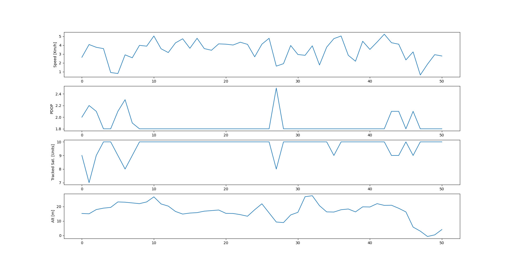
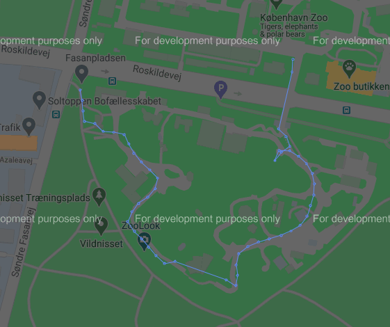

An odometer algorithm that uses GPS (NMEA sentences). It will parse a file with NMEA sentences and provide the distance traveled.

Pre-requisites:
- pynmea2
- gmplot
- matplotlib

To execute:
- Navigate to the project folder.
- Type "python3 odometer.py <input_file.txt>"

Output:
- A html file with the used points shown on a map;
- A .png file with charts of the route.

NMEA fields used:
- From GGA: latitude, longitude, fix quality and tracked satellites
- From RMC: speed and status
- From GSA: fix type and PDOP

Outputs example (the computed distance is printed on terminal, 630 meters for this example):

Some stats of the input data:

Plot on Google Maps:

Observation: The threshold parameters are optimized to compute distances traveled by a vehicle. Tweak them to your needs.

GitHub repo to get NMEA samples:

https://github.com/esutton/gps-nmea-log-files
